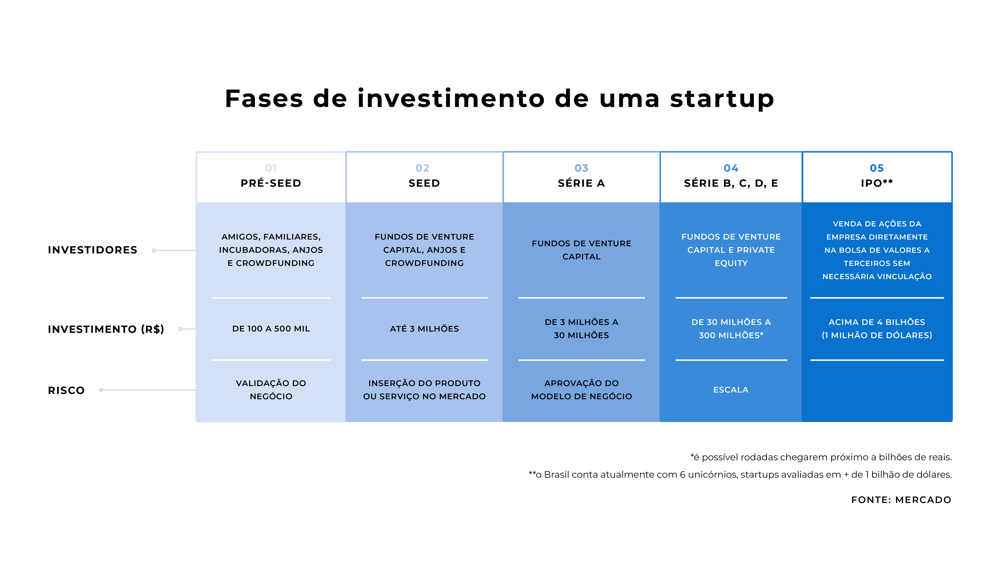

Você teve uma boa ideia, que tem tudo para emplacar no mercado. Mas depois de pedir ajuda aos amigos e aos parentes; e esgotar as reservas pessoais e o crédito em instituições financeiras, você se dá conta de que é preciso mais. Onde procurar esse financiamento?

Pela natureza, startups são novos negócios com projetos promissores e ideias inovadoras. Guiado pela espirito empreendedor, as novas empresas possuem riscos envolvidos. Mas, por serem caracterizadas por baixos custos iniciais e boas expectativas de crescimento, tornam-se bastante atraentes para investimentos.

## Pesquisa e Desenvolvimento (P&D)

Para o Fórum Econômico e Mundial, uma das principais formas de medir a inovação em um país é por meio da análise dos gastos em P&D. O Brasil aparece em nono lugar, investindo US$ 42,1 bilhões ao ano em pesquisa e desenvolvimento, ou seja, 2,3% do investimento global. Valores que ainda são considerados baixos, quando se leva em consideração a proporção do PIB, segundo dados do Instituto de Estatística da UNESCO.

No entanto, importantes programas de P&D, como o da Aneel, vêm possibilitando mudanças nesse cenário. O programa do setor elétrico é uma boa oportunidade para quem tem um projeto inovador voltado à energia elétrica. Aqui no Energy Future, maior chamada do setor, você tem todas as informações para inscrever seu projeto.

## Investidor anjo

O investidor anjo é alguém que está disposto a dedicar tempo e dinheiro às novas startups. Os investidores anjos podem ter qualquer formação e geralmente foram empreendedores ou capitalistas de risco. Eles são motivados pelo potencial de grandes retornos, pela capacidade de retribuir à comunidade empreendedora, assim como fornecer orientação aos novos empresários. 

O termo "anjo" é utilizado pelo fato de não ser um investidor exclusivamente financeiro, que fornece apenas o capital necessário para o novo negócio, mas por apoiar o empreendedor, aplicando seus conhecimentos, experiência e rede de relacionamento para orientá-lo e aumentar as chances de sucesso das novas empresas.

## Fundos de Investimento (Venture Capital)

Os fundos, chamados de Venture Capital, assemelham-se aos investidores anjos, mas são muito mais estruturados. Em vez de lidar com uma pessoa, o empreendedor agora passa a lidar com uma empresa especializada em fazer investimentos em startups. 

Com executivos e empreendedores no comando, os fundos diversificam aportes nas startups. A modalidade de financiamento é feito por empresas em troca de participação societária, determinando responsabilidades conjuntas para investidores e empreendedores. Os recursos são aplicados em startups que já tenham testado seus produtos ou serviços, validado no mercado, e estão prontas para se desenvolver.  

Só em 2018, os fundos investiram 5,1 bilhões de reais, de acordo com dados da Associação Latino Americana de Private Equity e Venture Capital. Montante que representa 65% dos investimentos feitos na América Latina.

## Plataformas de Investimento

A modalidade mais recente no Brasil, que vem conquistando novos investidores (pessoas físicas). Nessa fase de captação em plataformas, as startups geralmente já validaram os seus produtos no mercado e começam a crescer. Por isso, o investimento apresenta nível médio de risco. O valor investido por startup pode variar conforme a plataforma de investimento. 

## Crowdfunding

É uma forma rápida e relativamente simples de captar valores para a execução de uma ideia ou projeto que sejam populares. O objetivo é reunir diversas pessoas que possam colaborar com pequenas quantias e, assim, viabilizar uma ideia, um negócio ou um projeto, recebendo, ou não, uma contrapartida por isto.

### Fases de investimento de uma Startup:

*é possível rodadas chegarem próximo a bilhões de reais.

** O Brasil conta atualmente com 6 unicórnios, startups avaliadas em + de 1 bilhão dólares.

Fonte: Mercado